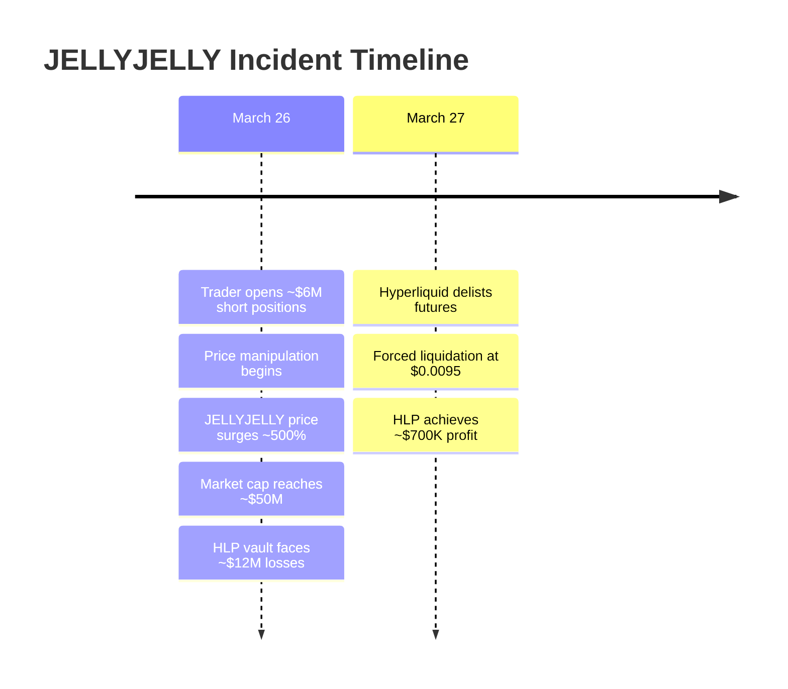

## 1. What happened

- Hyperliquid delisted JELLYJELLY perpetual futures due to market manipulation
- A trader attempted to profit through short positions and price manipulation
- HLP vault faced $12M unrealized losses but achieved $700K profit through forced liquidation
- Hyper Foundation to automatically compensate affected users (except marked addresses)

### 1.1 Event Overview

Last night, Hyperliquid delisted JELLYJELLY token's perpetual futures trading after detecting market manipulation. A trader opened approximately $6M in JELLYJELLY short positions, then attempted to profit through voluntary liquidation by pushing up the price through on-chain purchases.

This caused Hyperliquid's HLP vault to face ~$12M in unrealized losses. To minimize losses, Hyperliquid delisted JELLYJELLY and forced liquidated positions at $0.0095, ultimately resulting in ~$700K profit for the HLP.

Hyper Foundation will automatically compensate most affected users (except marked addresses) in the coming days, requiring no user action.

### 1.2 Market Reaction

```markdown
| Impact | Change |
|--------|--------|
| HYPE Price Drop | -22% |
| Monthly Decline | >30% |
| JELLYJELLY Surge | +500% |
| Market Cap Change | $10M → $50M |
```

- HYPE token price dropped 22% before partial recovery
- Monthly decline exceeds 30%
- Binance and OKX quickly listed JELLYJELLY perpetual futures
- JELLYJELLY token price surged nearly 500%
- Market cap increased from ~$10M to $50M

### 1.3 Notable Details

The incident not only exposed vulnerabilities in Hyperliquid's liquidation mechanism but also sparked industry-wide discussions about its decentralization. Bitget CEO Gracy Chen criticized Hyperliquid's handling as "immature, unethical, and unprofessional" on X, even comparing it to potential "FTX 2.0" risks.

### 1.4 Event Background

Hyperliquid is a decentralized exchange (DEX) operating on its own Layer-1 blockchain, known for low fees, fast trading, and perpetual derivatives trading tools. JELLYJELLY is a Solana-based meme token launched by Venmo co-founder Iqram Magdon-Ismail in January 2025, initially valued at ~$250M before declining to millions. As of March 26, its market cap was ~$25M.

### 1.5 Event Timeline



### 1.6 Technical Data

| Metric | Value |
|--------|--------|
| Event Date | March 26-27, 2025 |
| Trader Short Position | ~$6M |
| JELLYJELLY Price Increase | ~500% |
| HLP Max Unrealized Loss | ~$12M |
| Final HLP Profit | ~$700K |
| Settlement Price | $0.0095 |
| HYPE Token 24h Drop | 22% (max) |
| Monthly Decline | >30% |

### 1.7 Price Impact Formula

The price impact can be calculated using:

$$
\text{Price Impact} = \frac{P_{\text{final}} - P_{\text{initial}}}{P_{\text{initial}}} \times 100\%
$$

Where:
- $P_{\text{final}}$ is the final price
- $P_{\text{initial}}$ is the initial price

For JELLYJELLY:
$$
\text{Price Impact} = \frac{0.01 - 0.002}{0.002} \times 100\% = 400\%
$$

### 1.8 Industry Response

- **Bitget CEO Gracy Chen**: Criticized handling as "immature, unethical, unprofessional"
- **BitMEX Co-founder Arthur Hayes**: Questioned decentralization level
- **Supporters**: Praised intervention to prevent liquidity crisis

## 1.9 Technical Implications & Future Outlook

The incident revealed potential vulnerabilities in Hyperliquid's liquidation mechanism, particularly for low-liquidity token perpetual futures. Hyperliquid has committed to technical improvements to prevent similar market manipulation and enhance network stability.

## 1.10 Conclusion

The Hyperliquid-JELLYJELLY incident represents a market manipulation-triggered liquidity crisis. While Hyperliquid successfully mitigated losses through delisting and forced liquidation, the event sparked widespread debate about decentralization principles and operational integrity, potentially impacting future market position and user trust.

## 2. Basic Principles of Perpetual Futures Trading

Hyperliquid is a decentralized exchange (DEX) that offers perpetual futures trading. Perpetual futures are derivative contracts that allow traders to go long or short on an asset with leverage, without actually owning the underlying asset.

### 2.1 Key Features:

- **Leverage Effect**: Traders can control larger positions (e.g., 10x leverage) with a small margin (e.g., 10%)
- **Funding Rate**: Balance between longs and shorts is maintained through funding rates to prevent prices from deviating too far from spot markets
- **Liquidation Mechanism**: Positions are forcefully closed (liquidated) when price movements cause insufficient margin coverage, with the platform's liquidity providers (like Hyperliquid's HLP vault) taking over

In the JELLYJELLY incident:
- Manipulators exploited low liquidity characteristics by opening $6 million short positions
- They pushed up spot prices to trigger liquidations for profit
- With HLP as a passive counterparty and JELLYJELLY's shallow market depth
- HLP faced unrealized losses up to $12 million

### 2.2 Market Manipulation Principle: Short Squeeze

The core of the incident involved a "short squeeze" operation, executed as follows:

### 2.3 Short Squeeze Operation Steps:

1. **Opening Short Positions**:
   - Traders opened short positions on JELLYJELLY on Hyperliquid worth approximately $6 million, betting on price decline
   - Assuming 10x leverage, the actual margin requirement might have been only $600,000

2. **Pushing Up Spot Prices**:
   - Subsequently, traders made large purchases of JELLYJELLY tokens on-chain (likely on Solana's spot market), driving the price up nearly 500%
   - JELLYJELLY is a low market cap, low liquidity meme token with only several million in market value, so small amounts of capital could significantly impact prices

3. **Profiting from Liquidations**:
   - Perpetual futures prices typically track spot markets. When spot prices rise, unrealized losses on short positions increase
   - If losses exceed margin, short positions get liquidated, requiring the platform (HLP vault) to buy JELLYJELLY at higher market prices to close positions
   - Traders planned to profit by selling previously purchased spot tokens, offsetting or exceeding losses from short position liquidations

### 2.4 Example Principle:

Assuming JELLYJELLY's original price was $0.002, with traders shorting $6 million (10x leverage):
- Traders use $1 million to buy tokens in the spot market, pushing price to $0.01
- During short liquidation, HLP buys at $0.01, traders lose $6 million (short position value)
- Spot market sales could yield up to $5 million (depending on purchase volume), significantly reducing net losses or potentially turning profitable

### 2.5. Role of Hyperliquid's HLP Vault

Hyperliquid's HLP (Hyperliquidity Provider) vault is a decentralized liquidity pool, community-owned, responsible for:

- Providing market depth (buy/sell orders)
- Taking over liquidated positions
- Maintaining operations through trading fees and liquidation profits

During this incident:
- JELLYJELLY's price surge led to unrealized losses of $12 million on short positions, putting immense pressure on the HLP vault
- If liquidations executed at market price ($0.01), HLP would lose millions by buying tokens at high prices to close positions

### 2.6. Hyperliquid's Response: Trade Cancellation and Forced Liquidation

Hyperliquid's validators detected anomalies (possibly from on-chain data or trading patterns) and identified market manipulation, leading to:

### 2.7 Response Measures:

1. **Cancellation of JELLYJELLY Perpetual Futures Trading**:
   - Suspended market activity to prevent further price manipulation and losses

2. **Forced Liquidation**:
   - Settled all positions at $0.0095 (below market peak but above initial price)
   - Likely based on traders' initial entry price or internal algorithms to avoid HLP buying at peak prices

### 2.8 Results:
- HLP ultimately closed positions at lower prices, turning a $700,000 profit
- Traders' squeeze strategy failed as Hyperliquid didn't liquidate at expected market peaks

### 2.9 Technical Principles:
- As a Layer-1 blockchain, Hyperliquid's validators can modify transaction states through consensus
- This intervention resembles centralized exchange "risk control measures" but sparked controversy in a decentralized context

### 2.10 Compensation Mechanism Principles

Hyper Foundation promised compensation to affected users (excluding flagged manipulator addresses), based on:

- **On-chain Data Analysis**: Identifying affected users through blockchain records
- **Automatic Distribution**: Using smart contracts or on-chain scripts for direct refunds
- **Funding Source**: Likely from HLP vault profits or other reserves

Similar to traditional financial insurance payouts, aimed at maintaining user trust.

### 2.11 Exposed Vulnerabilities and Controversies

1. **Low Liquidity Token Risks**:
   - Small market cap tokens like JELLYJELLY are easily manipulated
   - Perpetual futures' high leverage amplifies risks

2. **Liquidation Mechanism Limitations**:
   - HLP vault may not withstand large-scale liquidations during extreme volatility

3. **Decentralization vs. Intervention**:
   - Hyperliquid's forced liquidations and trade cancellations questioned decentralization principles
   - Resembles centralized exchange practices

### 2.12 Summary

1. **Market Manipulation**: Traders exploited short positions and high leverage, attempting to profit through spot price manipulation
2. **Platform Response**: Hyperliquid protected the HLP vault through trading suspension and forced liquidations
3. **Consequences**: Exposed vulnerabilities in perpetual futures markets with low liquidity and raised questions about intervention boundaries in decentralized platforms

From a technical perspective, this was a battle between "price manipulation" and "platform risk control," where Hyperliquid's intervention successfully prevented traders' plans but sparked discussions about transparency and fairness in decentralized exchanges.

## 3. Analysis of Price Manipulator's Profit Mechanism

### 3.1 Overview
The way price manipulators attempted to profit from manipulating JELLYJELLY token prices might sound complex, but it can be explained with simple logic and steps. Let me explain step by step how the price manipulators planned to make money and why they ultimately failed.

### 3.2 Price Manipulator's Profit Mechanism
The core strategy of price manipulators was to utilize perpetual futures leverage and spot market price correlation to generate profits through a "Short Squeeze." Here's their plan:

Step 1: Opening Large Short Positions
- Manipulators opened $6 million worth of JELLYJELLY short positions on Hyperliquid
- A short position means "borrowing tokens to sell, expecting to buy back at a lower price and profit from the difference"
- Assuming an initial price of $0.002, a $6 million short position equals selling 30 million JELLYJELLY tokens ($6 million ÷ $0.002 = 30 million)
- They likely used high leverage (e.g., 10x), only putting up $600,000 as margin

Step 2: Pushing Up Spot Market Prices
- Manipulators then used their own funds (e.g., $1 million) to buy large amounts of JELLYJELLY tokens on-chain (like Solana's spot market)
- Since JELLYJELLY is a low market cap, low liquidity token (total market value of only several million), a small amount of capital could significantly drive up the price
- They managed to push the price from $0.002 to $0.01 (5x increase)

Step 3: Short Position Liquidation and Spot Market Profits
In the perpetual futures market, when spot prices rose to $0.01, the short positions generated massive unrealized losses:
- Initial sell value: 30 million tokens × $0.002 = $600,000
- Current buyback cost: 30 million tokens × $0.01 = $3 million
- Unrealized loss: $3 million - $600,000 = $2.4 million

If losses exceed the margin ($600,000), the short position would be liquidated, requiring Hyperliquid's HLP vault to buy back 30 million tokens at $0.01 to close the position.

Manipulators planned to sell their previously purchased tokens in the spot market at $0.01:
- Assume they bought $500,000 worth of tokens at $0.002 (25 million tokens)
- Selling at $0.01: 25 million × $0.01 = $2.5 million
- Spot market profit: $2.5 million - $500,000 = $2 million

Step 4: Calculating Net Profit
- Short position liquidation loss: $2.4 million
- Spot market profit: $2 million
- Net result: $2 million - $2.4 million = -$400,000 (small loss, but could be profitable with larger spot purchases)

If manipulators invested more to push prices higher (e.g., to $0.02) or had larger short positions, profits could be higher.

### 3.3 Real-Life Example
Imagine you're at a farmers market:
1. You borrow 100 apples (short position), sell them for $1 each, making $100, promising to return them later
2. You buy 50 apples in another market for $50, then spread rumors about "apple prices rising," pushing the price to $5 each
3. The person who lent you apples sees the $5 price, fears you won't repay, and forces you to buy back now. You spend $500 buying 100 apples to repay, losing $400
4. But you sell your 50 apples in the other market for $5 each, making $250 (50 × $5)
5. Total: -$400 (short position) + $250 (spot) = -$150 net loss
6. If you had bought more apples (e.g., 100), making $500, you could have netted $100 profit

Price manipulators used similar tactics, first borrowing to sell short, then pushing prices up to profit from spot sales.

### 3.4 Why Didn't the Manipulators Profit This Time?
The manipulators' plan relied on Hyperliquid liquidating short positions at market highs (e.g., $0.01), but Hyperliquid detected the anomaly:
- They cancelled JELLYJELLY perpetual futures trading
- Forced liquidation at a lower fixed price ($0.0095) instead of market peak

Results:
- Short position liquidation losses were contained (possibly less than expected)
- May not have sold all spot holdings in time, or sold at lower prices than expected
- Spot market profits weren't enough to cover short position losses, possibly resulting in losses due to market intervention

Simply put: Hyperliquid didn't follow the manipulators' script, intervening early and causing their squeeze strategy to fail.

### 3.5 Summary: Manipulator's Profit Logic
- **Goal**: Trigger short position liquidations by pushing up spot prices, using spot profits to cover short losses and potentially profit more
- **Key**: Use leverage to amplify short positions, manipulate low liquidity token prices with minimal capital
- **Failure Reason**: Hyperliquid's intervention broke the "high-price liquidation" premise

## 4. DEX vs CEX Differences

The reason why the JELLYJELLY incident (market manipulation leading to potential massive losses) occurred on Hyperliquid but rarely happens on centralized exchanges (CEX) like OKX and Binance fundamentally lies in their differences in architecture, operational models, and risk control mechanisms. Here's a detailed explanation from both theoretical and practical perspectives:

### 4.1 Differences in Architecture and Liquidity Management

#### Hyperliquid (DEX):
- Hyperliquid is a decentralized perpetual futures exchange running on its own Layer-1 blockchain, using on-chain orderbooks and HLP (Hyperliquidity Provider) vault for liquidity support.
- HLP is a community-owned liquidity pool responsible for market making and liquidations, bearing counterparty risks. When extreme market volatility occurs (like JELLYJELLY's 500% price surge), HLP must take over liquidated positions at high prices. If liquidity is insufficient or counterparties are missing, HLP could face massive losses.
- For low market cap, low liquidity tokens (like JELLYJELLY), Hyperliquid's on-chain mechanisms struggle to adjust quickly, as liquidity entirely depends on HLP and users, unlike CEX's dynamic intervention capabilities.

#### OKX and Binance (CEX):
- Centralized exchanges maintain proprietary liquidity pools and powerful internal market-making teams, capable of real-time market depth adjustments to ensure counterparty availability even in extreme conditions.
- CEXs don't rely on user-provided liquidity, instead maintaining market stability through centralized management (including proprietary funds, external market makers, and algorithms). This means they can quickly suppress volatility using internal resources when someone attempts price manipulation, preventing liquidation mechanism failures.

**Key Difference**: Hyperliquid's decentralized nature limits its immediate liquidity control, while CEX's centralized architecture allows more flexible responses to market anomalies.

### 4.2 Liquidation Mechanism Vulnerabilities and Intervention Capabilities

#### Hyperliquid:
- In the JELLYJELLY incident, manipulators exploited low liquidity characteristics by opening $6 million short positions and pushing up spot prices to trigger liquidations for profit. With HLP as a passive counterparty and JELLYJELLY's shallow market depth, HLP faced unrealized losses up to $12 million.
- Hyperliquid's liquidations rely on on-chain data and preset rules, preventing real-time manual intervention. The issue was ultimately resolved through validator voting to cancel trades and force liquidations, exposing mechanism vulnerabilities against market manipulation.
- Decentralized systems lack adequate protection for small-cap tokens, making them vulnerable to "short squeeze" strategies.

#### OKX and Binance:
- CEXs' liquidation mechanisms are optimized through years of experience, featuring robust risk control systems. They set higher margin requirements, limit leverage, or suspend trading during abnormal volatility.
- Upon detecting manipulation signs (like unusual volume or price deviation), CEXs can immediately freeze accounts, adjust price sources (independent from single markets), or even rollback trades. These interventions are routine in centralized systems but require community consensus in DEXs, making them slower and less efficient.
- CEX prices typically reference multiple external markets (other exchanges or oracles), not single on-chain data, reducing manipulation risks from individual markets.

**Key Difference**: Hyperliquid's liquidation mechanisms are constrained by decentralized rules and on-chain liquidity, while CEXs possess stronger active intervention capabilities and multi-source price protection.

### 4.3 Regulatory and Experience Gap

#### Hyperliquid:
- As a relatively young DEX (mainnet launched in 2023), Hyperliquid's technology and risk control are still evolving. This incident serves as a "learning experience," exposing weaknesses in handling low liquidity token perpetual futures.
- Decentralized platforms typically lack KYC (identity verification), making it easier for malicious actors to operate anonymously, increasing manipulation risks.

#### OKX and Binance:
- OKX and Binance are mature CEXs tested by years of market experience (Binance founded 2017, OKX/OKEx even earlier). They've encountered and resolved similar market manipulation issues, like the 2018-2019 "liquidation cascades" and "flash crashes."
- CEXs typically maintain strict KYC and AML (anti-money laundering) policies, enabling user identity tracking and deterring potential manipulators. They also work with regulators, maintaining stronger compliance and risk resistance.

**Key Difference**: Hyperliquid lacks CEXs' historical experience and regulatory constraints, appearing "inexperienced" in handling market manipulation.

### 4.4 Market Selection Strategy Differences

#### Hyperliquid:
- Hyperliquid allows trading of small-cap tokens including meme coins (like JELLYJELLY), attracting speculators but increasing risks. Low liquidity token perpetual futures are easily manipulated due to insufficient market depth.
- Its decentralized design encourages openness but lacks screening mechanisms for high-risk assets.

#### OKX and Binance:
- CEXs typically list perpetual futures for high market cap, high liquidity mainstream tokens (like BTC, ETH), with strict criteria for small-cap tokens. Even when listing tokens like JELLYJELLY, they limit leverage or trading size to avoid liquidity crises.
- During the JELLYJELLY incident, OKX and Binance quickly listed its perpetual futures but avoided similar impacts due to sufficient liquidity and robust risk control, instead attracting trading volume.

**Key Difference**: Hyperliquid's openness to low liquidity tokens is a double-edged sword, while CEXs avoid similar issues through careful selection and strong backing.

### 4.5 Community Response and External Competition

#### Hyperliquid:
- Post-incident, Hyperliquid's native token HYPE dropped over 20%, reflecting market trust erosion. The community questioned its decentralization level, viewing validator intervention as CEX-like behavior.
- DEX reputation heavily depends on transparency and stability, with this incident exposing vulnerabilities.

#### OKX and Binance:
- CEX users are accustomed to centralized intervention, not questioning platforms over similar incidents. Instead, OKX and Binance opportunistically listed JELLYJELLY perpetual futures, attracting Hyperliquid's traffic and demonstrating competitive flexibility.
- Analysis suggests manipulators might be CEX-related (ZachXBT traced related wallets receiving funds from Binance), indicating external competition may have exacerbated Hyperliquid's predicament.

**Key Difference**: Hyperliquid's decentralized positioning makes it more sensitive to trust crises, while CEXs' centralized nature better suits market dynamics.

### 4.6 Summary

Why did this happen to Hyperliquid but not OKX and Binance?

1. **Insufficient Liquidity**: Hyperliquid relies on limited HLP liquidity, struggling with extreme small-cap token volatility, while CEXs have proprietary and external market-making support.
2. **Limited Intervention**: Hyperliquid's decentralized mechanisms react slowly, requiring validator voting, while CEXs can intervene real-time manually.
3. **Experience Gap**: Hyperliquid is still learning to handle market manipulation, while CEXs have years of optimization.
4. **Asset Selection Risk**: Hyperliquid's openness to high-risk tokens creates vulnerabilities, while CEXs are more cautious.
5. **Market Positioning**: Hyperliquid's DEX identity makes it more susceptible to trust fluctuations, while CEXs capitalize on opportunities.

In essence, Hyperliquid's decentralization ideals exposed vulnerabilities when facing real market manipulation, while OKX and Binance effectively avoid similar crises through centralized advantages and mature experience. This indicates DEXs still need technical and mechanical improvements to combat malicious behavior effectively.